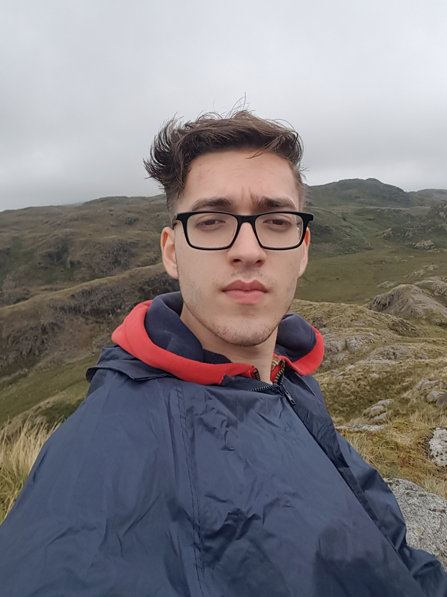
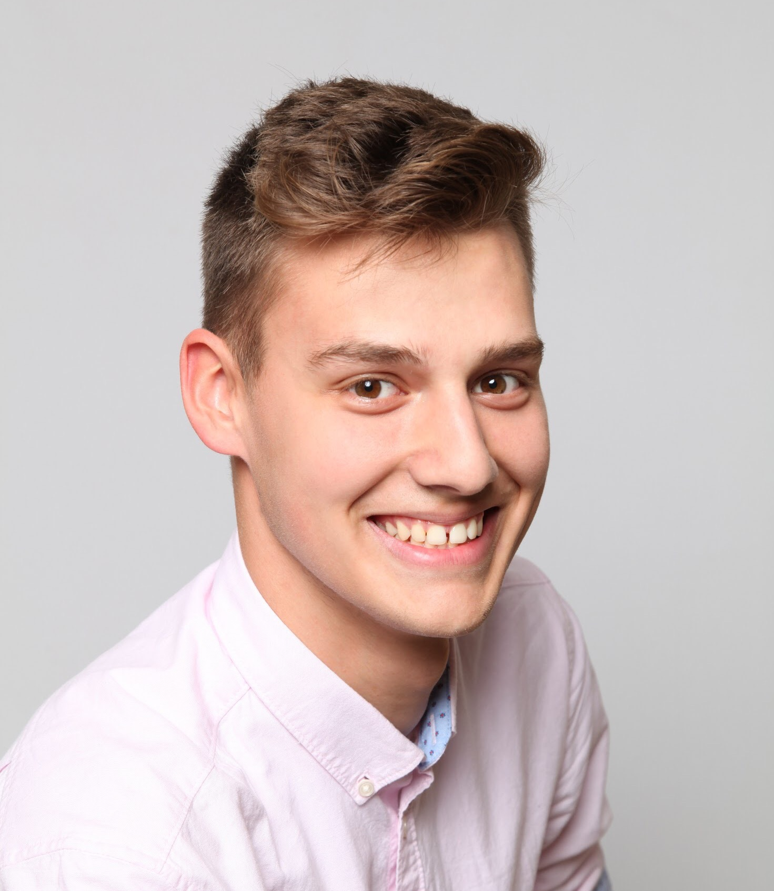

# Group 4

### Name: Gyum Cho

### Student number: 4840054

My plan for self development:

During the OOP project, I want to develop my programming skill about using Java. Since my first try of Java at first quarter was not successful, this time i will fully participate in shared lab and get help from TA. Also, for each week during the team meeting I will try to find the good coding method by cooperate with my teammate. Individually, I start the code-academy for learn the basic uses of IntelliJ.

##  

### Name: Erwin van Dam

### Student number: 4928113

My plan for self development:

This is the first time I have to work in a group of 7, which I didn't know before the project started. To functionally cooperate with this group is my biggest goal. Next to that I want to improve in developing applications from scratch. During the process I hope to pick up some IntelliJ skills.

##  

### Name: Eyüp Vroegop

### Student number: 4929578

My plan for self development:

My goal during the course is getting better at Java because I want to pass my Algorithms and Data-structures exam, if I pass my exam I will consider this goal achieved.

Currently, I'm making extra exercises on places like LeetCode to practice my Java skills, and I can  recognise that I'm not familiar enough with Java to have a clear idea on what I'm doing. I need to search a lot of stuff up and really think about it, thus I want to reach the level of skill so that I can quickly know what to do when starting to code something.

A lot of practice is required to achieve this goal, and there's probably no better way of achieving this goal than practice. During the course I hope to get to know more about Java, and my teammates will probably be a big part in this, furthermore together with practice on my own I hope to achieve my goal.

##  

### Name: Marko Matusovic

### Student number: 4908406

#### Personal Development Plan

Working on some software group project in the past, showed me just how hard it is to utilise multiple people in one software project. During this course I hope to improve my **collaboration skills** and gain knowledge of how to **work effectively together**. I am looking forward to learning new methods of **task distribution** and **team management**. Besides teamwork, I hope to get familiar with **git version control** and improve my overall programming skills. Furthermore, I am perfectionist, which means I spend too much time on things that do not matter. I want to learn how to plan and **manage my time** to focus on important tasks and thus **improving my effectiveness**.

To attaining given goals:
- I will communicate with my group-mates openly and often
- I will research connected topics deeply to fully understand them
- I will plan thoroughly, this will allow me focus on important things and suppress my habit of wasting time

Reaching those goals will not be easy but with enough dedication, it will be manageable. To maintain my dedication I can simply remind myself that I am working on a fun group project with my peeps and that the sole process of doing so is rewarding enough. :)

##

### Name: Shruti Arora

### Student number: 4770501

My plan for self development:

My strength is to achieve goals and not give up even if they seem almost impossible.

My main goals are learning how to manipulate git and also learning how to work as a part of a large software team. The way I intend to do this is to proactively take part in the team and stop myself from trying to be overly independent. With github I intend to get familiar as much as I can.
