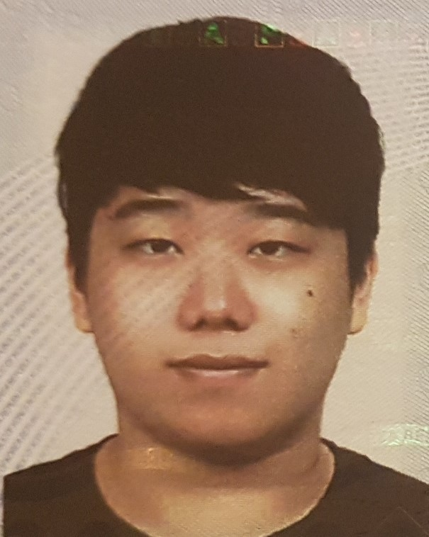

Name: Gyum Cho

Student number: 4840054

My plan for self develop: 

During the OOP project, I want to develop my programming skill about using Java. Since my first try of Java at first quater was not successful, this time i wull fully participate in shared lab and get help from TA. Also, for each week during the team meeting I will try to find the good coding method by cooperate with my teammate. Individually, I start the code-accademy for learn the basic uses of Intellij.

Name: Erwin van Dam

Student number: 4928113

My plan for self develop: